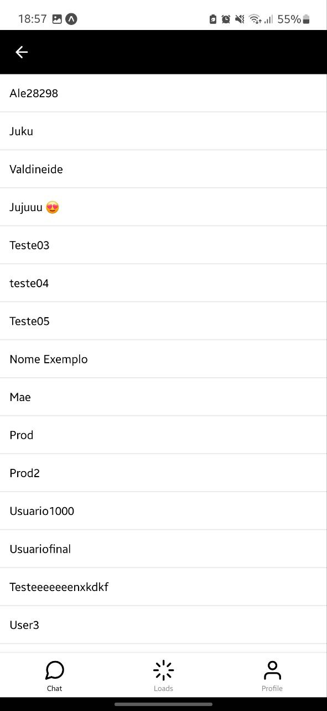
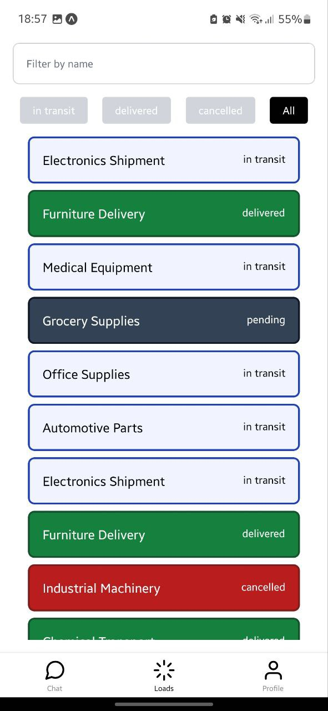
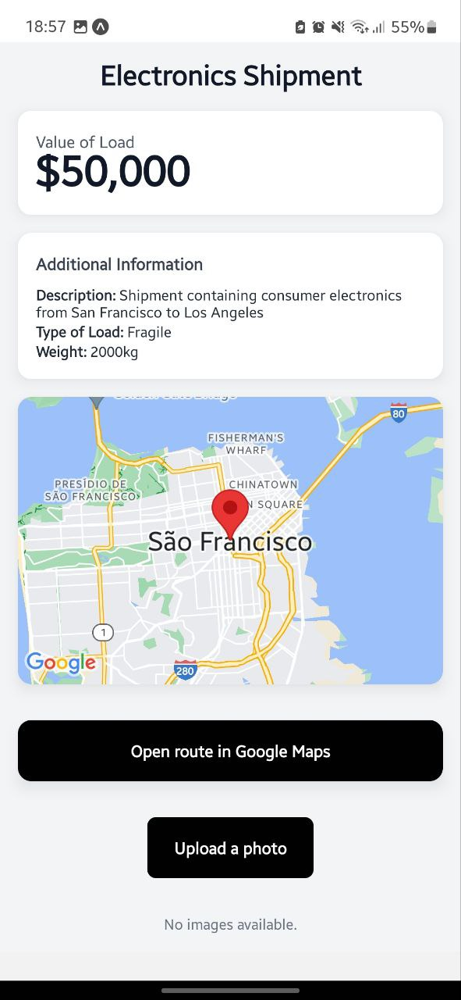
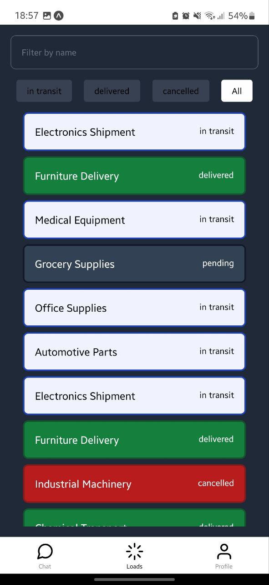

# BillorDriverApp - Documentation

## Introduction
BillorDriverApp is an application developed with Expo, React Native, and TypeScript, using Supabase as the backend. The project includes features such as route visualization, data storage, image capture, maps, and push notifications.

## Setup and Execution

### Available Scripts
- `npm install`: Downloads all dependencies.
- `npm start`: Starts the project in the Expo Dev Client.
- `npm run android`: Runs the app on Android.
- `npm run ios`: Runs the app on iOS.
- `npm run web`: Runs the app on the web.

## Main Dependencies

### ⚛️ Expo and React Native
- `expo`: Development environment for React Native.
- `react-native`: Main library for mobile development.
- `react`: Library for building the user interface.

### 🧭 Navigation
- `@react-navigation/native`: Main navigation library.
- `@react-navigation/bottom-tabs`: Implements bottom tab navigation.

### State Management and Validation
- `react-hook-form`: Form management.
- `@hookform/resolvers`: Integration of react-hook-form with Zod.
- `zod`: Schema validation library.

### ⚙️ Backend and Storage
- `@supabase/supabase-js`: Supabase SDK for backend interaction.
- `@react-native-async-storage/async-storage`: Local asynchronous storage.
- `react-native-url-polyfill`: URL support for React Native.
- `react-native-uuid`: UUID generation.
- `uuid`: Additional library for UUIDs.

### 🎇 UI and Themes
- `nativewind`: Integrates TailwindCSS with React Native.
- `tailwindcss`: Utility styles library.

## Conclusion
BillorDriverApp is a robust application that combines the best tools for modern mobile development. With Expo, React Native, Supabase, TypeScript, and other libraries, it offers a comprehensive solution for mobile app development.

## App Images

  
  
  
  
  
  
  
  

Made by Clark